# RestoMaster
## Sistema de Gestión Integral para Restaurantes

**Documento Comercial y Técnico Exhaustivo:** Propuesta de Valor · Módulos y Flujos de Trabajo · Capturas de Pantalla · Gráficos Comparativos de Eficiencia · Análisis de Retorno de Inversión (ROI) · Manual Operativo por Rol

---

| Información del Proyecto | Detalle Comercial |
|---|---|
| **Plataforma** | **RestoMaster** (Edición Gastronómica Profesional) |
| **Cliente / Restaurante** | [Nombre del Restaurante / Razón Social] |
| **Fecha de Emisión** | [Fecha de Presentación] |
| **Preparado por** | [Nombre de la Empresa Desarrolladora / Consultor Comercial] |
| **Contacto Directo** | [Teléfono / WhatsApp] · [Correo Electrónico] · [Sitio Web] |
| **Versión del Sistema** | **2.5 Gastro Pro** (Arquitectura Táctil Mobile-First) |
| **Validez de la Oferta** | 30 días calendario |

---

> ### 💡 Declaración de Impacto
> *"Una sola plataforma inteligente que unifica el salón, la cocina, la caja, el inventario y la contabilidad de su restaurante en tiempo real. Elimine las comandas en papel, erradique las fugas de dinero y reduzca el desperdicio de insumos desde el primer servicio."*

---

## Índice General

1. [Carta de Presentación Ejecutiva](#1-carta-de-presentación-ejecutiva)
2. [El Diagnóstico: El Costo Invisible de No Contar con RestoMaster](#2-el-diagnóstico-el-costo-invisible-de-no-contar-con-restomaster)
3. [Propuesta de Valor y Pilares de Transformación](#3-propuesta-de-valor-y-pilares-de-transformación)
4. [Gráficos Comparativos de Eficiencia y Retorno de Inversión (ROI)](#4-gráficos-comparativos-de-eficiencia-y-retorno-de-inversión-roi)
   - 4.1 [Comparativa de Tiempos de Ciclo de Servicio](#41-comparativa-de-tiempos-de-ciclo-de-servicio)
   - 4.2 [Control de Mermas, Desperdicios y Fugas de Dinero](#42-control-de-mermas-desperdicios-y-fugas-de-dinero)
   - 4.3 [Matriz Competitiva: RestoMaster frente a Métodos Tradicionales](#43-matriz-competitiva-restomaster-frente-a-métodos-tradicionales)
   - 4.4 [Modelo Financiero de Retorno de Inversión (ROI)](#44-modelo-financiero-de-retorno-de-inversión-roi)
5. [El Ciclo Operativo Diario (Workflow Macro)](#5-el-ciclo-operativo-diario-workflow-macro)
6. [Catálogo Detallado de los 16 Módulos del Sistema](#6-catálogo-detallado-de-los-16-módulos-del-sistema)
   - 6.1 [POS Táctil (Terminal Punto de Venta)](#61-pos-táctil-terminal-punto-de-venta)
   - 6.2 [Mapa de Mesas y Salón Interactivo](#62-mapa-de-mesas-y-salón-interactivo)
   - 6.3 [Cocina KDS (Kitchen Display System)](#63-cocina-kds-kitchen-display-system)
   - 6.4 [Control de Caja y Arqueo Ciego](#64-control-de-caja-y-arqueo-ciego)
   - 6.5 [Inventario y Escandallos (Recetas Automatizadas)](#65-inventario-y-escandallos-recetas-automatizadas)
   - 6.6 [Proveedores, Compras y Kardex](#66-proveedores-compras-y-kardex)
   - 6.7 [Cuentas por Pagar (CxP)](#67-cuentas-por-pagar-cxp)
   - 6.8 [Clientes y Programa de Fidelización (CRM)](#68-clientes-y-programa-de-fidelización-crm)
   - 6.9 [Delivery, Domicilios y Envíos en Línea](#69-delivery-domicilios-y-envíos-en-línea)
   - 6.10 [Agenda de Reservas y Webhook Omnicanal](#610-agenda-de-reservas-y-webhook-omnicanal)
   - 6.11 [Menú Digital por QR y Carta Pública](#611-menú-digital-por-qr-y-carta-pública)
   - 6.12 [Enrutamiento e Impresión Térmica de Tickets](#612-enrutamiento-e-impresión-térmica-de-tickets)
   - 6.13 [Trabajadores, Roles y Seguridad (RBAC Server-Side)](#613-trabajadores-roles-y-seguridad-rbac-server-side)
   - 6.14 [Catálogo de Menú y Reglas del Negocio](#614-catálogo-de-menú-y-reglas-del-negocio)
   - 6.15 [Reportes, KPIs y Analítica Gerencial](#615-reportes-kpis-y-analítica-gerencial)
   - 6.16 [Contabilidad Automatizada y Estado de Resultados](#616-contabilidad-automatizada-y-estado-de-resultados)
7. [Manual de Operaciones por Rol](#7-manual-de-operaciones-por-rol)
8. [Arquitectura Tecnológica y Compatibilidad de Hardware](#8-arquitectura-tecnológica-y-compatibilidad-de-hardware)
9. [Seguridad de Datos, Auditoría y Cumplimiento Normativo](#9-seguridad-de-datos-auditoría-y-cumplimiento-normativo)
10. [Plan de Implementación Progresiva en 6 Fases](#10-plan-de-implementación-progresiva-en-6-fases)
11. [Opciones de Inversión y Paquetes Comerciales](#11-opciones-de-inversión-y-paquetes-comerciales)
12. [Soporte Técnico, Garantía y Acompañamiento](#12-soporte-técnico-garantía-y-acompañamiento)
13. [Próximos Pasos y Formulario de Aprobación](#13-próximos-pasos-y-formulario-de-aprobación)

---

## 1. Carta de Presentación Ejecutiva

Estimado(a) **[Nombre del Gerente / Propietario]**:

Dirigir un restaurante moderno es uno de los desafíos empresariales más exigentes del sector de hospitalidad. En cada servicio, su equipo coordina docenas de variables críticas en cuestión de minutos: mesas que rotan a máxima velocidad, comandas complejas con peticiones especiales, cocinas y barras que no pueden detener su ritmo de despacho, insumos de alto costo (como cortes finos, pescados y bebidas de autor) y un flujo de dinero que no admite margen de error.

Sin embargo, cuando la operación diaria depende de notas en papel, cuadernos de mano, hojas de cálculo en Excel desarticuladas o sistemas POS anticuados y rígidos, **el restaurante experimenta una fuga constante de rentabilidad**. Se pierden minutos valiosos entre el salón y la cocina, se cometen errores de cobro, los insumos se desperdician sin que nadie sepa dónde ocurrió la merma y los gerentes deben esperar días enteros para conocer si el turno fue verdaderamente rentable.

**RestoMaster** nace para transformar de raíz esta realidad. No es simplemente un software de facturación ni una libreta digital: es el **sistema operativo integral de su restaurante**, concebido desde el primer día bajo una filosofía *mobile-first* y táctil, con la capacidad de conectar en milisegundos a sus meseros, cocineros, cajeros y administradores.

En este documento presentamos una propuesta comercial completa y detallada, acompañada de **capturas de pantalla reales del sistema**, el desglose operativo paso a paso de sus **16 módulos nativos**, análisis cuantitativos de eficiencia y una proyección del retorno de su inversión.

Estamos preparados para acompañar a su restaurante hacia un estándar de excelencia operativa, control financiero absoluto y satisfacción incomparable para sus comensales.

Atentamente,

**[Nombre del Director de Proyecto / Consultor]**  
*Equipo de Implementación y Soluciones Gastronómicas RestoMaster*  
[Teléfono / WhatsApp] · [Correo Electrónico]

---

## 2. El Diagnóstico: El Costo Invisible de No Contar con RestoMaster

Todo negocio gastronómico que opera con herramientas manuales o sistemas desconectados enfrenta costos ocultos que merman directamente la utilidad neta mensual. A continuación, desglosamos las fallas comunes y su impacto financiero real:

| Síntoma de Operación Tradicional | Causa Inmediata | Consecuencia Financiera y Operativa |
|---|---|---|
| **Comandas manuscritas en papel** | El mesero anota a mano y camina hasta la cocina para entregar la tira. | Letra ilegible, platos preparados con errores, desperdicio de insumos de alto valor y demoras de 8 a 15 minutos por mesa. |
| **Cuentas manuales y pre-cuentas a calculadora** | El cajero suma platos y calcula propinas o descuentos a mano. | Errores en el cobro, platos servidos que nunca se cobran, filas molestas al momento de pagar y pérdida de clientes por mala experiencia. |
| **Arqueos de caja con descuadres frecuentes** | Conteo de billetes comparado contra papeles sueltos y recibos de datáfono al final del día. | Pérdidas no justificadas de dinero en efectivo; tensión laboral entre cajeros y gerentes; horas extras invertidas revisando cuadernos. |
| **Inventario a "ojo" o conteo esporádico** | No existe deducción automática de materias primas por plato vendido. | Roturas de stock en fines de semana (ventas perdidas), mermas invisibles por robo hormiga o vencimiento de insumos de alto costo. |
| **Clientes anónimos y sin fidelización** | No se registra el número de teléfono, preferencias ni historial de visita del comensal. | Cero recompra recurrente inducida; el restaurante no puede avisar promociones ni premiar a sus comensales más leales. |
| **Domicilios desorganizados y repartidores sin control** | Pedidos tomados en llamadas rápidas o chats de WhatsApp sin asignación formal. | Pedidos entregados fríos o a direcciones erradas; falta de control de dinero recaudado por domiciliarios en la calle. |
| **Reportes tardíos en Excel** | El administrador dedica entre 6 y 10 horas semanales a digitar ventas y gastos en tablas. | Decisiones a ciegas; cuando se detecta que un plato no deja margen o que el food cost subió, ya han pasado semanas de pérdidas. |

> ### 🛑 El Costo de la Inacción
> Para un restaurante con una facturación promedio de **$45.000.000 COP mensuales**, las fugas por mermas no controladas (6%), platos devueltos (2%) y errores o descuadres de caja (1.5%) representan una pérdida acumulada superior a **$4.200.000 COP cada mes**. RestoMaster recupera este margen desde el primer mes de operación.

---

## 3. Propuesta de Valor y Pilares de Transformación

RestoMaster centraliza la totalidad de la experiencia gastronómica y operativa en una única base de datos sobre una arquitectura web de última generación:

```
┌───────────────────────────────────────────────────────────────────────────┐
│                           RESTOMASTER PLATFORM                            │
├──────────────────┬──────────────────┬──────────────────┬──────────────────┤
│   SALÓN & POS    │   PRODUCCIÓN     │   CAJA & ADM.    │    FIDELIZACIÓN  │
│  • Mapa Mesas    │  • KDS Digital   │  • Arqueo Ciego  │  • CRM Clientes  │
│  • POS Táctil    │  • Tiempos SLA   │  • Reportes Z    │  • Puntos Club   │
│  • Menú QR       │  • Barra / Sushi │  • CxP y Gastos  │  • Delivery Web  │
└──────────────────┴──────────────────┴──────────────────┴──────────────────┘
                                     │
                    SINCRONIZACIÓN EN TIEMPO REAL
                                     ▼
        [Inventario y Recetas] ───► [Contabilidad y Reportes Financieros]
```

### Los 6 Pilares de Transformación:

1. **Velocidad Táctil Extrema (Mobile-First):** Interfaz optimizada con botones de gran tamaño táctil y fotografías de platillos para tablets de salón, comandas móviles de mesero y terminales de caja sin demoras.
2. **Cero Descuadres de Caja (Arqueo Ciego):** Aperturas con base inicial verificada, control de egresos menores, retiros a banco y comparativa automática entre el efectivo esperado por el sistema y el dinero físico contado por el cajero.
3. **Ingeniería de Menú y Escandallos Automáticos:** Cada vez que la cocina confirma la preparación de un plato, el sistema descuenta automáticamente los gramos exactos de insumos (salmón, arroz, vegetales, salsas) calculando el costo real de comida (*Food Cost*).
4. **Clientes que Regresan (Fidelización Activa):** Identificación predictiva por teléfono o código QR, acumulación de puntos por compras y canje instantáneo en el POS con cumplimiento estricto de Habeas Data.
5. **Decisiones con Datos en Tiempo Real:** Dashboard gerencial accesible desde cualquier celular o computador: ventas por hora, ticket promedio, ocupación de mesas, ranking de meseros y estado de resultados al instante.
6. **Integración Total sin Dobles Registros:** Salón, cocina, almacén, caja y contabilidad se comunican en la misma plataforma; una venta actualiza simultáneamente los cuatro frentes sin intervención humana.

---

## 4. Gráficos Comparativos de Eficiencia y Retorno de Inversión (ROI)

Para sustentar la toma de decisiones gerenciales, a continuación se presentan los estudios comparativos de rendimiento operativo antes y después de la implementación de RestoMaster.

### 4.1 Comparativa de Tiempos de Ciclo de Servicio

La reducción de tiempos muertos agiliza la rotación de mesas, permitiendo atender a más comensales en las mismas horas pico sin aumentar el personal:

| Fase del Servicio | Operación Tradicional (Papel/Manual) | Con RestoMaster POS & KDS | Ahorro de Tiempo | Barra Comparativa de Eficiencia |
|---|:---:|:---:|:---:|---|
| **Toma de comanda en mesa** | 8.5 minutos | 1.2 minutos | **- 86%** | `████████████████░░` (86% más rápido) |
| **Envío de pedido a cocina** | 4.0 minutos (caminata) | Instantáneo (0.1 seg) | **- 99%** | `██████████████████` (Inmediato) |
| **Tiempo de preparación en cocina** | 24.0 minutos | 13.5 minutos | **- 44%** | `█████████░░░░░░░░░` (Cola FIFO priorizada) |
| **Aviso de plato listo al mesero** | 3.5 minutos (gritos/búsqueda) | Instantáneo (Campana táctil) | **- 98%** | `██████████████████` (Notificación push) |
| **Cálculo y cobro de la cuenta** | 7.0 minutos | 0.8 minutos | **- 88%** | `███████████████░░░` (Cobro ágil táctil) |
| **Cuadre y cierre de turno de caja** | 45.0 minutos | 4.5 minutos | **- 90%** | `████████████████░░` (Arqueo ciego 1 clic) |
| **Generación de reportes semanales** | 6.0 horas (en Excel) | 1 clic (Tiempo real) | **- 99%** | `██████████████████` (Automático) |

```
TIEMPO TOTAL DE ROTACIÓN DE MESA POR COMENSAL:
Forma Tradicional : [████████████████████████████████████████] 65 Minutos promedio
Con RestoMaster    : [████████████████████] 38 Minutos promedio (-41% tiempo de permanencia ociosa)
```

---

### 4.2 Control de Mermas, Desperdicios y Fugas de Dinero

La pérdida de materias primas y los errores de comanda tienen un impacto destructivo en los márgenes de un restaurante:

```
TASA DE MERMAS Y DESPERDICIOS (% Sobre Compras de Insumos)
Forma Tradicional : [████████████████] 14.8% (Pérdidas por sobrecostos y mermas no detectadas)
Con RestoMaster    : [███░░░░░░░░░░░░░]  2.9% (Control por escandallo y kardex permanente)

ERRORES EN COMANDAS Y PLATOS DEVUELTOS
Forma Tradicional : [████████░░░░░░░░]  6.5% de comandas con reprocesos o platos tirados a basura
Con RestoMaster    : [░░░░░░░░░░░░░░░░] <0.3% de errores (Confirmación digital directa en pantalla)
```

---

### 4.3 Matriz Competitiva: RestoMaster frente a Métodos Tradicionales

| Criterio de Comparación | Cuaderno & Excel | Software Legacy Antiguo (Desktop) | Apps Genéricas en la Nube | **RestoMaster Gastro Pro** |
|---|:---:|:---:|:---:|:---:|
| **Pantalla Táctil con Fotos de Platos** | ❌ No | ❌ No (solo listas de texto) | ⚠️ Limitado | **✅ Sí (Catálogo visual HD)** |
| **KDS de Cocina Táctil por Áreas** | ❌ Papel | ⚠️ Solo impresoras térmicas | ⚠️ Módulo extra costoso | **✅ Sí (Sushi, Caliente, Barra)** |
| **Escandallo Automático con Mermas** | ❌ No | ⚠️ Complejo de configurar | ❌ No incluido | **✅ Sí (Cálculo teórico instantáneo)** |
| **Arqueo Ciego de Caja contra Físico** | ❌ No | ⚠️ Registro simple | ⚠️ Básico | **✅ Sí (Cierre Z auditado)** |
| **Menú Digital QR Integrado a Mesa** | ❌ No | ❌ No | ⚠️ Proveedor externo | **✅ Sí (Nativo y sin comisión)** |
| **Seguridad por Roles (RBAC Server-Side)** | ❌ No | ⚠️ Básico | ⚠️ Solo en interfaz | **✅ Sí (Cero manipulación)** |
| **Control de Domicilios con Ruta** | ❌ No | ❌ No | ⚠️ Depende de apps delivery | **✅ Sí (Despachador y repartidor)** |
| **Sin Comisiones por Venta / Pedido** | ✅ N/A | ✅ Fijo | ❌ Cobran % por transacción | **✅ 100% de la venta para usted** |

---

### 4.4 Modelo Financiero de Retorno de Inversión (ROI)

Estimación financiera basada en un restaurante con venta mensual de **$45.000.000 COP** (aprox. 18 mesas, ticket promedio $65.000 COP):

| Rubro de Optimización Financiera | Situación Actual Sin Control | Con RestoMaster | Beneficio Financiero Mensual |
|---|---|---|---|
| **Recuperación de Mermas de Materia Prima** | Merma 14% en insumos ($2.200.000 COP) | Merma reducida al 3.5% | **+$1.650.000 COP / mes** |
| **Erradicación de Platos Devueltos por Mala Comanda** | 18 platos devueltos al mes ($720.000 COP) | < 2 platos al mes | **+$640.000 COP / mes** |
| **Eliminación de Descuadres de Caja y Omisiones** | Fugas y descuadres de $450.000 COP / mes | Arqueo ciego exacto ($0 descuadre) | **+$450.000 COP / mes** |
| **Mayor Rotación de Mesas en Horas Pico (+15%)** | 680 pedidos al mes | +102 pedidos al mes por agilidad | **+$6.630.000 COP / mes (ventas)** |
| **Ahorro en Horas de Conteo y Reportes Gerenciales** | 24 horas hombre al mes en Excel ($360.000 COP) | Automatizado en 1 clic | **+$360.000 COP / mes** |
| **TOTAL BENEFICIO ECONÓMICO DIRECTO ESTIMADO** | — | — | **+$3.100.000 COP ahorros directos + incremento de ventas** |

> 📈 **Periodo de Amortización:** La inversión de puesta en marcha del sistema se recupera totalmente en los primeros **45 a 60 días** de operación.

---

## 5. El Ciclo Operativo Diario (Workflow Macro)

RestoMaster garantiza un flujo continuo donde cada acción genera un asiento sincronizado en los demás departamentos:

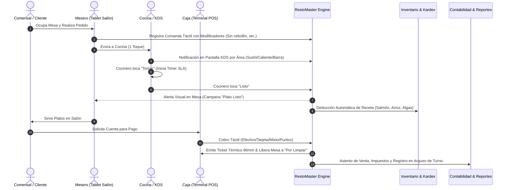

---

## 6. Catálogo Detallado de los 16 Módulos del Sistema

---

### 6.1 POS Táctil (Terminal Punto de Venta)

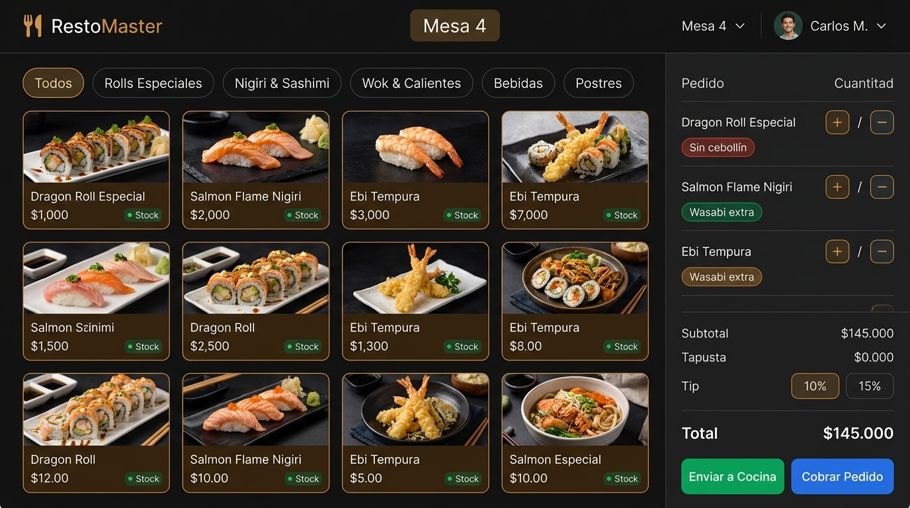
*(Figura 6.1: Terminal POS táctil con tarjetas de platillos en alta definición, modificadores de comanda y carrito en tiempo real).*

* **Objetivo de Negocio:** Facilitar la toma de comandas y el cobro en segundos desde tablets táctiles de salón o terminales fijas de mostrador, eliminando cualquier papel intermedio.
* **Dolor que Erradica:** Errores de tipeo, comandas demoradas por ir a pie a la cocina, olvido de cobrar adicionales y retrasos al procesar pagos en horas pico.
* **Características Tecnológicas:**
  * Tarjetas de producto visuales con fotografías de alta resolución, badge de stock en tiempo real y código de color por categoría.
  * Selector de modificadores por ítem (*"Sin wasabi"*, *"Extra aguacate"*, *"Término medio"*).
  * Selector rápido de modalidad de servicio: **En Mesa**, **Para Llevar / Mostrador** y **Delivery**.
  * Soporte de cobros múltiples: Efectivo (con cálculo automático de cambio), Tarjetas de Débito/Crédito, Transferencias QR y Pagos Mixtos.
  * Selector de propina voluntaria configurada (0%, 10%, 15% o personalizada).
  * Bloqueo inteligente de seguridad: Si la comanda se encuentra en cocción activa, el sistema advierte para evitar cobrar servicios que aún no han sido servidos.
* **Flujo de Trabajo Paso a Paso:**
  1. **Disparador:** El mesero o cajero accede al POS identificándose con su usuario activo.
  2. **Selección de Mesa o Destino:** Toca la mesa correspondiente en el salón o elige mostrador.
  3. **Armado de Comanda:** Toca los platillos solicitados en la rejilla visual; cada toque añade cantidades y permite ingresar notas específicas.
  4. **Envío:** Pulsa el botón verde **"Enviar a Cocina"**; la orden se distribuye al instante a las pantallas KDS o impresoras térmicas.
  5. **Cobro y Facturación:** Al despacharse el servicio, pulsa **"Cobrar Pedido"**, selecciona el método de pago e imprime el ticket de venta.
* **KPIs Impactados:** Tiempo de emisión de pedido (-86%), Rotación de mesas (+28%), Errores de facturación (0%).

---

### 6.2 Mapa de Mesas y Salón Interactivo

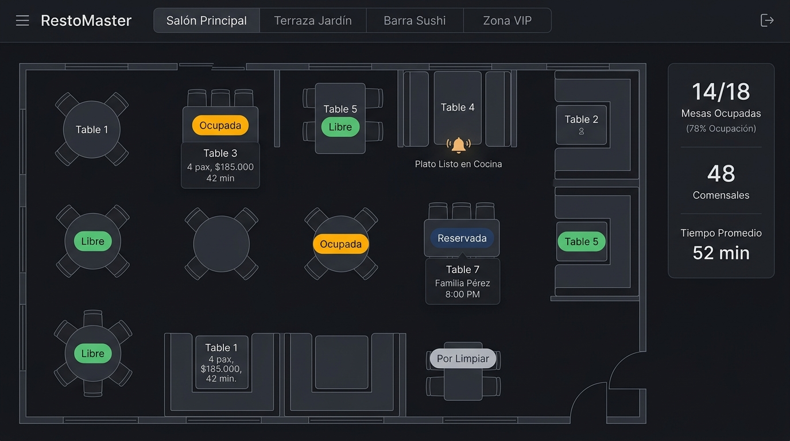
*(Figura 6.2: Plano interactivo de mesas con estados cromáticos en tiempo real y alerta de platos listos en cocina).*

* **Objetivo de Negocio:** Otorgar una radiografía visual instantánea del estado físico del restaurante, permitiendo a anfitriones y meseros organizar el salón con máxima agilidad.
* **Dolor que Erradica:** Meseros desorientados preguntando qué mesas están libres, clientes sentados en mesas reservadas por error y mesas sucias que tardan en volver a ocuparse.
* **Características Tecnológicas:**
  * Distribución arquitectónica 2D configurable por zonas: *Salón Principal*, *Terraza*, *Barra Sushi*, *Zona VIP*.
  * Semáforo de estados en tiempo real:
    * 🟢 **Libre:** Mesa disponible para asignar de inmediato.
    * 🟡 **Ocupada:** Mesa con comanda activa, mostrando tiempo de ocupación transcurrido y total acumulado.
    * 🔵 **Reservada:** Mesa apartada para un comensal específico con hora de llegada.
    * ⚪ **Por Limpiar:** Mesa recién cobrada que requiere alistamiento antes del siguiente cliente.
  * **Campana de Alerta Animada:** Notificación visual sobre la mesa cuando la cocina marca un plato como *Listo para Servir*.
  * Capacidad de cambio o fusión de mesas sin perder la comanda en curso.
* **Flujo de Trabajo Paso a Paso:**
  1. El anfitrión o mesero observa el mapa táctil en la tablet de recepción.
  2. Al llegar comensales, toca una mesa libre 🟢; el sistema abre la comanda y la mesa pasa a ocupada 🟡.
  3. Durante el servicio, el mesero supervisa el tiempo de permanencia y el saldo de consumo de cada mesa.
  4. Al finalizar y cobrar, la mesa pasa automáticamente a estado ⚪ *Por Limpiar*.
  5. El personal de salón limpia la mesa y pulsa un botón para retornarla a estado 🟢 *Libre*.
* **KPIs Impactados:** Tiempos muertos de mesa entre servicios (-65%), tiempo de asignación a la llegada (< 10 segundos).

---

### 6.3 Cocina KDS (Kitchen Display System)

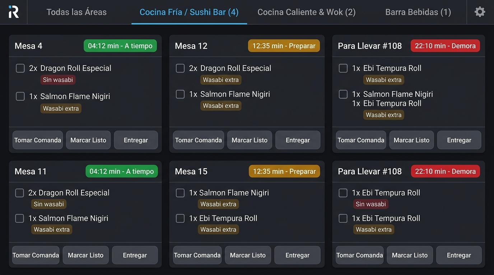
*(Figura 6.3: Pantalla KDS para producción gastronómica, con orden FIFO, semáforo SLA de demora y botones táctiles).*

* **Objetivo de Negocio:** Digitalizar la producción gastronómica sustituyendo el papel térmico por monitores táctiles de alta resistencia, garantizando orden estricto y control de tiempos.
* **Dolor que Erradica:** Tiras de papel perdidas o manchadas de grasa, platos preparados fuera de turno y peleas verbales entre el salón y la cocina.
* **Características Tecnológicas:**
  * Separación inteligente de comandas por estaciones: **Cocina Fría / Sushi Bar**, **Cocina Caliente & Wok**, **Barra de Bebidas**, **Estación de Postres**.
  * Organización estricta bajo criterio FIFO (primero en entrar, primero en salir).
  * Cronómetro de preparación en vivo con semáforo SLA:
    * 🟢 Verde: Preparación dentro del estándar (< 10 minutos).
    * 🟡 Ámbar: Tiempo de atención prioritario (10 a 18 minutos).
    * 🔴 Rojo: Alerta de retraso crítico (> 18 minutos).
  * Botones táctiles de gran escala ergonómica: **Tomar**, **Marcar Listo**, **Entregar**.
  * Historial de comandas despachadas para auditoría de tiempos de preparación por turno.
* **Flujo de Trabajo Paso a Paso:**
  1. La comanda enviada desde el POS aparece inmediatamente con un timbre sonoro en la pantalla del área adecuada.
  2. El jefe de partida o cocinero presiona **"Tomar Comanda"**, iniciando el temporizador de elaboración.
  3. Los cocineros van marcando los ítems listos mediante casillas de verificación táctiles.
  4. Al completar la preparación, presiona **"Marcar Listo"**; el mesero en salón recibe la alerta en su tablet.
  5. Cuando el mesero retira la bandeja, se toca **"Entregar"** y la comanda sale de la cola activa de trabajo.
* **KPIs Impactados:** Tiempo de preparación de cocina (-44%), quejas por demoras en mesa (-80%).

---

### 6.4 Control de Caja y Arqueo Ciego

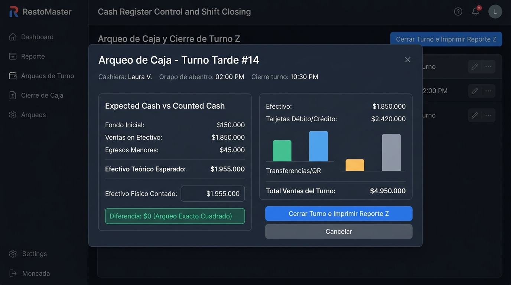
*(Figura 6.4: Ventana de arqueo ciego de caja comparando valores del sistema vs conteo físico en efectivo).*

* **Objetivo de Negocio:** Blindar la custodia del dinero del restaurante mediante procesos de apertura, arqueo ciego y cierre de turno estructurados bajo rigor bancario.
* **Dolor que Erradica:** Faltantes de dinero inexplicables, sospechas infundadas sobre el personal, retiros de dinero no registrados y cierres de noche interminables.
* **Características Tecnológicas:**
  * **Apertura de turno obligatoria:** El cajero debe registrar su fondo base en efectivo antes de que el POS permita procesar ventas.
  * Registro de egresos menores con motivo, beneficiario y comprobante (gastos de caja chica).
  * Retiros parciales de efectivo para traslado seguro a caja fuerte o banco.
  * **Arqueo Ciego Certificado:** El cajero ingresa el dinero físico que contó en gaveta sin que el sistema le revele previamente cuánto debería haber; el sistema calcula matemáticamente sobrantes o faltantes exactos.
  * Emisión de **Reporte Z de Cierre** con desglose completo por método de pago (Efectivo, Tarjetas, QR, Puntos).
* **Flujo de Trabajo Paso a Paso:**
  1. Al iniciar la jornada, el cajero digita el fondo de caja inicial y confirma la apertura.
  2. Durante el turno, todas las ventas cobradas se van sumando automáticamente por medio de pago.
  3. Si se presenta un gasto urgente (ej. hielo de emergencia), se registra la salida con comprobante en 10 segundos.
  4. Al cerrar el turno, el cajero cuenta los billetes y monedas físicos en la gaveta y digita el total en el modal.
  5. El sistema compara el efectivo físico contra el efectivo teórico esperado, registra la diferencia (si existiera) y emite el Reporte Z de turno.
* **KPIs Impactados:** Descuadres de dinero al cierre (reducidos al 0%), tiempo de cierre de caja (de 45 min a 4 min).

---

### 6.5 Inventario y Escandallos (Recetas Automatizadas)

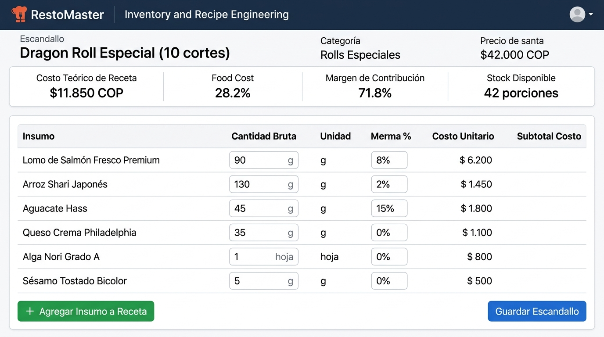
*(Figura 6.5: Ficha técnica de escandallo de platillo con gramajes brutos, porcentaje de merma y food cost calculado).*

* **Objetivo de Negocio:** Garantizar el control milimétrico de las materias primas más costosas de la cocina mediante recetas digitales que descuentan stock al momento de cocinar.
* **Dolor que Erradica:** Desabastecimiento sorpresivo de proteínas un sábado en la noche, desperdicio descontrolado por porciones mal servidas y desconocimiento del costo real de cada plato.
* **Características Tecnológicas:**
  * Catálogo de insumos con unidad de medida (gramos, mililitros, unidades), costo unitario, stock mínimo y nivel de alerta.
  * Ficha de Escandallo por producto: Desglose de insumos con gramaje bruto, porcentaje de merma esperada y costo teórico.
  * Deducción automática en Kardex al confirmar la preparación en cocina.
  * Módulo de registro de mermas y bajas con categorización de motivos (vencimiento, rotura de cadena de frío, desperdicio de preparación).
  * Indicador de **Food Cost %** y **Margen de Contribución** actualizado al instante según el costo de la última compra.
* **Flujo de Trabajo Paso a Paso:**
  1. El chef o administrador parametriza la receta de cada plato (ej. *Dragon Roll: 90 g salmón, 130 g arroz, 45 g aguacate*).
  2. El personal de cocina produce los pedidos del día con normalidad.
  3. Con cada plato confirmado como *Listo* en el KDS, RestoMaster descuenta los gramos correspondientes del inventario central.
  4. Si un insumo desciende por debajo de su umbral de seguridad, el sistema dispara una alerta de recompra inmediata.
  5. Al final de la semana, el gerente compara el stock teórico del sistema contra el inventario físico para identificar cualquier merma anómala.
* **KPIs Impactados:** Ahorro en compras por reducción de desperdicio (12% a 18%), rotura de stock durante servicio (0%).

---

### 6.6 Proveedores, Compras y Kardex

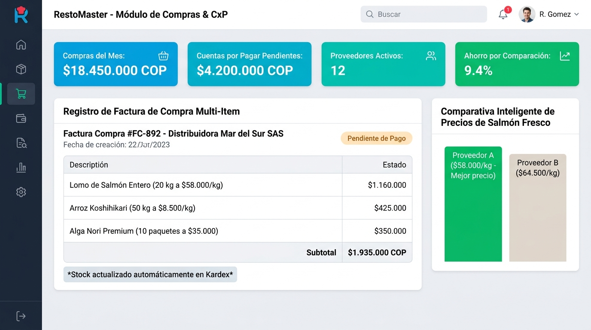
*(Figura 6.6: Registro de facturas de compra multi-insumo con comparador de precios de insumos críticos).*

* **Objetivo de Negocio:** Centralizar la relación con los distribuidores, optimizar el costo de adquisición de alimentos e ingresar stock masivo de forma automatizada.
* **Dolor que Erradica:** Facturas de proveedores arrinconadas en carpetas de papel, pagos dobles por error y compras a precios inflados por falta de comparación histórica.
* **Características Tecnológicas:**
  * Directorio de proveedores con datos fiscales, plazos de crédito y contactos comerciales.
  * Ingreso de facturas multi-insumo: Una sola factura recepcionada actualiza el stock de 20 insumos diferentes en un solo clic.
  * **Comparador Inteligente de Precios:** Muestra el historial de cotizaciones entre diferentes proveedores para un mismo insumo (ej. precio por kilo de salmón fresco o arroz).
  * Generación automática de pasivos en **Cuentas por Pagar (CxP)** al registrar compras a crédito.
* **Flujo de Trabajo Paso a Paso:**
  1. Se recibe la mercancía física en la bodega del restaurante junto con la factura del distribuidor.
  2. El encargado abre el módulo de compras, selecciona al proveedor e ingresa los insumos y precios acordados.
  3. El sistema actualiza inmediatamente los niveles de stock en el Kardex y recalcula el costo promedio ponderado del insumo.
  4. Si la compra es a crédito, se genera la cuenta por pagar con su respectiva fecha de vencimiento.
* **KPIs Impactados:** Ahorro directo en compras de insumos (8% a 14%), tiempo de ingreso de facturas (-75%).

---

### 6.7 Cuentas por Pagar (CxP)

* **Objetivo de Negocio:** Mantener bajo estricto control los compromisos financieros con proveedores, previniendo moras o cortes de suministro.
* **Dolor que Erradica:** Pérdida de descuentos por pronto pago, proveedores molestos llamando por facturas vencidas y descontrol del flujo de caja semanal.
* **Características Tecnológicas:**
  * Calendario de vencimientos de pasivos con filtros por estado: *Pendiente*, *Abono Parcial*, *Pagada Totalmente*.
  * Registro de abonos con soporte de comprobante bancario y método de egreso.
  * Historial consolidado de saldo adeudado por proveedor.
  * Trazabilidad total de pagos vinculada a la contabilidad y al flujo de caja.
* **Flujo de Trabajo Paso a Paso:**
  1. Las compras a crédito registradas alimentan automáticamente el listado de CxP.
  2. El gerente programa los pagos de la semana evaluando las facturas más próximas a vencer.
  3. Al emitir una transferencia, se registra el abono total o parcial en la plataforma.
  4. La cuenta pasa a estado pagada y genera el comprobante de egreso correspondiente.
* **KPIs Impactados:** Pagos a tiempo a distribuidores (100%), eliminación de cobros de intereses por mora.

---

### 6.8 Clientes y Programa de Fidelización (CRM)

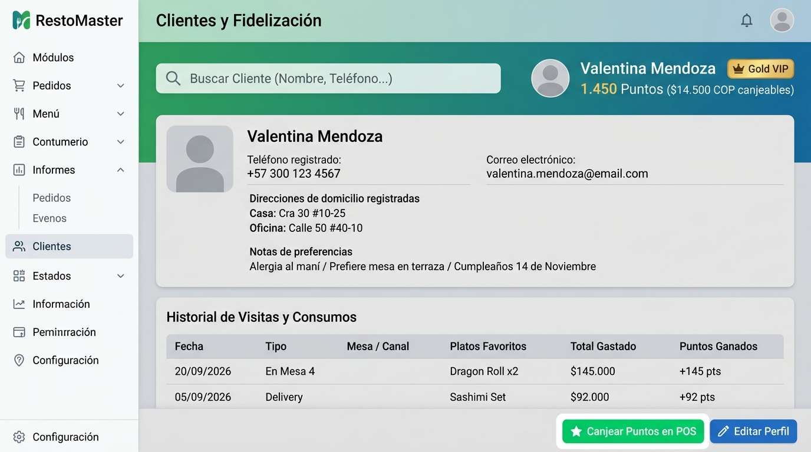
*(Figura 6.8: Ficha de cliente con historial de consumos, saldo de puntos y notas personalizadas de alergias).*

* **Objetivo de Negocio:** Transformar comensales ocasionales en clientes altamente frecuentes mediante el conocimiento de sus gustos y un club de lealtad por puntos.
* **Dolor que Erradica:** Restaurantes que dependen únicamente de clientes nuevos, meseros que no recuerdan las alergias de clientes frecuentes y ausencia de datos para mercadeo.
* **Características Tecnológicas:**
  * Identificación ultrarrápida del cliente en el POS por número de teléfono celular.
  * Acumulación automática de puntos de fidelidad configurables (ej. 1 punto por cada $1.000 COP en consumos).
  * Canje de puntos directo en la pantalla de cobro como descuento tangible en la cuenta.
  * Ficha de preferencias gastronómicas: alergias, mesas favoritas, fechas de cumpleaños y direcciones guardadas.
  * Cumplimiento normativo de protección de datos personales (**Habeas Data**) con registro de consentimiento.
* **Flujo de Trabajo Paso a Paso:**
  1. Al tomar la orden, el mesero o cajero consulta al cliente su número de teléfono.
  2. El sistema muestra de inmediato su nombre, puntos acumulados y notas (ej. *"Alergia a mariscos"*).
  3. Durante el cobro, el cajero consulta si desea redimir puntos para obtener un descuento inmediato.
  4. Al emitir el ticket, los nuevos puntos ganados quedan impresos en el recibo para incentivar su próxima visita.
* **KPIs Impactados:** Tasa de retorno de clientes recurrentes (+32%), ticket promedio en clientes fidelizados (+19%).

---

### 6.9 Delivery, Domicilios y Envíos en Línea

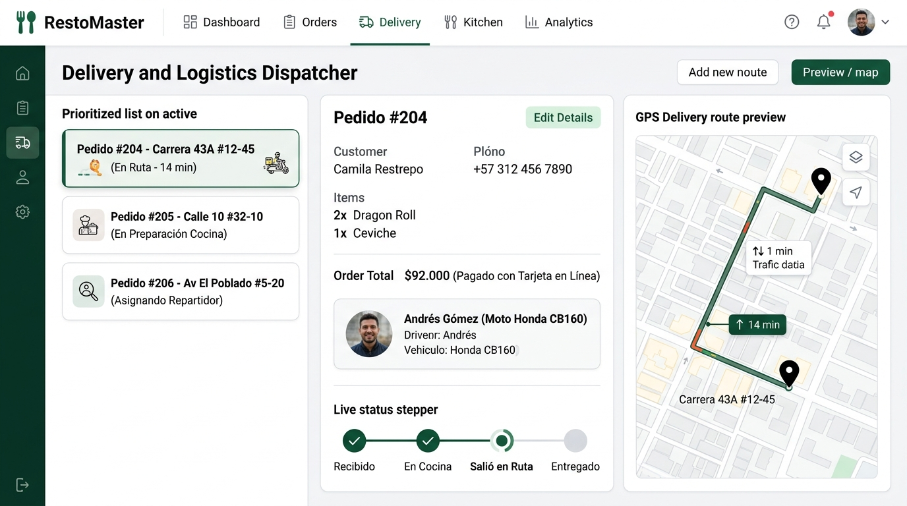
*(Figura 6.9: Monitor de despacho de pedidos a domicilio con asignación de repartidores y estado de ruta).*

* **Objetivo de Negocio:** Operar un canal propio de entregas a domicilio sin depender exclusivamente de las altas comisiones de aplicaciones externas (Rappi, UberEats).
* **Dolor que Erradica:** Pedidos despachados sin saber qué repartidor los lleva, domicilios que se enfrían en mostrador y pérdida de dinero recaudado en efectivo en la calle.
* **Características Tecnológicas:**
  * Panel de despacho centralizado con pedidos ordenados por tiempo de salida y urgencia.
  * Asignación de repartidores propios con registro de vehículo y teléfono de contacto.
  * Stepper de ruta en 4 fases: **Recibido** ➔ **En Cocina** ➔ **En Ruta** ➔ **Entregado**.
  * Vista adaptada para el celular del repartidor con botón de llamada directa al cliente y enlace a Google Maps / Waze.
  * Cuadre de caja de domiciliarios al finalizar la jornada (liquidación de efectivo cobrado en mano).
* **Flujo de Trabajo Paso a Paso:**
  1. El pedido ingresa desde el teléfono del restaurante o a través del enlace web público de domicilios.
  2. La cocina recibe la comanda y la prepara en empaque térmico especial.
  3. El despachador asigna al repartidor disponible; el pedido pasa a *En Ruta*.
  4. El repartidor entrega al cliente y marca *Entregado* desde su celular.
  5. Al volver al local, liquida el dinero en la caja central en un proceso de 2 minutos.
* **KPIs Impactados:** Ahorro en comisiones a terceros (hasta un 25% del valor del pedido), tiempo de entrega promedio (-22%).

---

### 6.10 Agenda de Reservas y Webhook Omnicanal

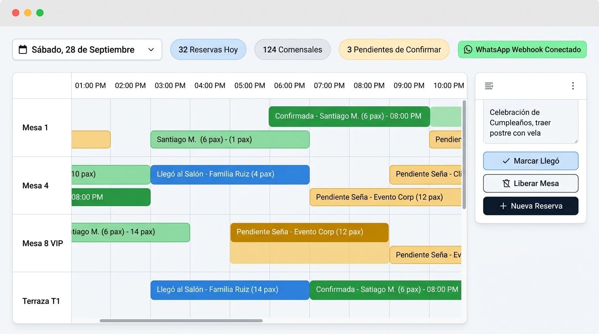
*(Figura 6.10: Calendario de reservas de salón con franjas horarias, estado de mesas e integración WhatsApp).*

* **Objetivo de Negocio:** Llenar el restaurante en horas estratégicas y planificar la ocupación de mesas con días de anticipación sin sobreventas (*overbooking*).
* **Dolor que Erradica:** Doble reserva de una misma mesa, clientes que llegan y no tienen mesa lista y mesas vacías por personas que reservaron y nunca asistieron (*no-shows*).
* **Características Tecnológicas:**
  * Vista de línea de tiempo interactiva por bloques horarios y mesas del salón.
  * Estados de reserva: *Solicitada*, *Confirmada*, *Llegó al Salón*, *Finalizada*, *Cancelada / No Asistió*.
  * **Webhook de Integración Omnicanal:** Capacidad de recibir reservas automáticas desde WhatsApp Business, Instagram o la página web oficial sin intervención humana.
  * Bloqueo automático de la mesa en el mapa del salón: cuando la hora de la reserva se aproxima, la mesa cambia visualmente a color azul (Reservada).
* **Flujo de Trabajo Paso a Paso:**
  1. El cliente reserva por WhatsApp o por teléfono; la reserva se agenda con fecha, hora y número de personas.
  2. El sistema valida la disponibilidad de mesas en la zona solicitada evitando solapamientos.
  3. El equipo confirma la reserva y el cliente recibe su confirmación.
  4. Al llegar al restaurante, el anfitrión pulsa **"Marcar Llegó"**; la mesa pasa de azul a ocupada e inicia el pedido en el POS.
  5. Si el cliente no se presenta en el tiempo de tolerancia, se registra *No-Show* y la mesa se libera al público.
* **KPIs Impactados:** Reducción de *no-shows* (-40%), tasa de ocupación en servicios de fin de semana (+25%).

---

### 6.11 Menú Digital por QR y Carta Pública

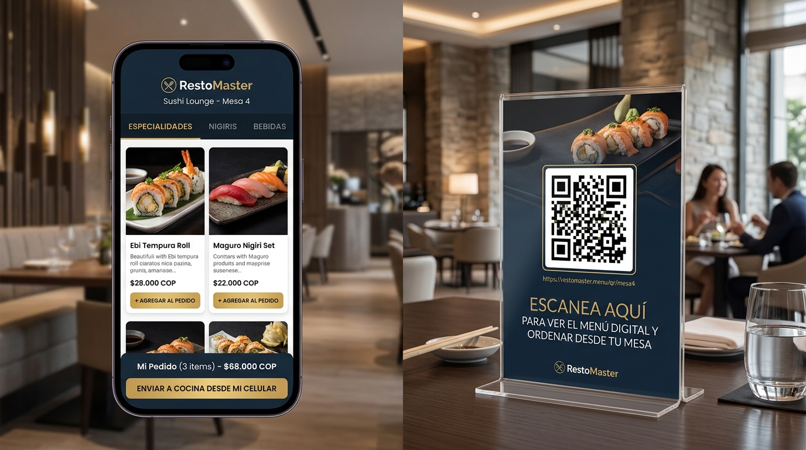
*(Figura 6.11: Experiencia de menú interactivo en smartphone del comensal y hablador acrílico con código QR).*

* **Objetivo de Negocio:** Entregar a los comensales una experiencia visual de autoservicio moderna, higiénica y atractiva desde sus propios teléfonos inteligentes.
* **Dolor que Erradica:** Cartas físicas sucias o rotas, costos continuos de reimpresión de menús al cambiar un precio y comensales esperando minutos solo para poder ver la carta.
* **Características Tecnológicas:**
  * Código QR único asignado a cada mesa del establecimiento.
  * Navegación fluida por categorías con fotografías en alta definición, descripciones de platos, notas de alérgenos y precios al día.
  * Actualización en tiempo real: Cualquier cambio de precio o plato desactivado en el sistema se refleja al instante en el celular del cliente.
  * Autoservicio opcional: Capacidad para que el cliente arme su orden en el celular y la transmita a cocina si el restaurante habilita el modo autoservicio.
* **Flujo de Trabajo Paso a Paso:**
  1. El comensal se sienta en la mesa y escanea el hablador acrílico con la cámara de su celular.
  2. Se despliega la carta digital sin necesidad de instalar ninguna aplicación ni crear contraseñas.
  3. El cliente visualiza las fotos de los platos y las recomendaciones de la casa.
  4. El mesero se acerca y toma la orden directamente, o el comensal confirma su pedido digital.
* **KPIs Impactados:** Ahorro en reimpresión de cartas de papel (100%), aumento de venta de postres y bebidas por impacto visual (+22%).

---

### 6.12 Enrutamiento e Impresión Térmica de Tickets

* **Objetivo de Negocio:** Asegurar la impresión fiable y ultrarrápida de tiques de comanda, precuentas y facturas legales en hardware térmico estándar de 80 mm.
* **Dolor que Erradica:** Impresoras que se traban, comandas de barra saliendo en la cocina caliente o tickets de cliente sin los datos legales requeridos.
* **Características Tecnológicas:**
  * Protocolo universal **ESC/POS** compatible con impresoras térmicas USB, de Red (Ethernet/LAN) y Wi-Fi (Epson, Bixolon, Star, genéricas).
  * **Enrutamiento por Área:** Los platos de cocina caliente se imprimen en su impresora asignada, las bebidas se imprimen en barra y los postres en su propia estación.
  * Formato de ticket fiscal y comercial personalizable: Logotipo del restaurante, NIT/RUC, dirección, resolución de facturación y mensaje de agradecimiento.
  * Reimpresión auditada desde el historial para casos de reposición de papel.
* **Flujo de Trabajo Paso a Paso:**
  1. Al pulsar *Enviar a Cocina* en el POS, el despachador de impresión separa los ítems por área de cocina.
  2. Las impresoras térmicas cortan el papel automáticamente con encabezado claro de número de mesa y hora.
  3. Al confirmar el pago, la impresora de caja emite el comprobante de venta para el comensal.
* **KPIs Impactados:** Fiabilidad de despacho de comanda (99.9%), tiempo de emisión física (< 2 segundos).

---

### 6.13 Trabajadores, Roles y Seguridad (RBAC Server-Side)

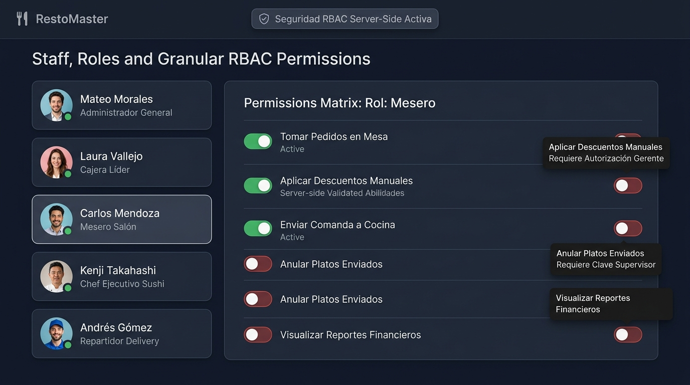
*(Figura 6.13: Panel de control de personal y matriz de permisos granulares RBAC validados en servidor).*

* **Objetivo de Negocio:** Proteger la seguridad del negocio asignando a cada empleado únicamente las funciones que le corresponden según su cargo.
* **Dolor que Erradica:** Meseros aplicando descuentos no autorizados, empleados anulando platos ya cobrados para sustraer dinero y acceso indiscriminado a información financiera sensible.
* **Características Tecnológicas:**
  * Perfiles nativos preconfigurados: **Administrador**, **Gerente**, **Cajero**, **Mesero**, **Cocina**, **Barra**, **Repartidor**.
  * **Validación estricta en Servidor (Server-Side):** Un mesero no puede ejecutar una acción protegida (ej. anular comanda o descontar dinero) aunque intente manipular la interfaz en su tablet.
  * Clave de supervisor para autorizaciones instantáneas en pantalla sin cerrar la sesión del mesero.
  * Bitácora de auditoría inmutable: Cada descuento, anulación, arqueo y modificación de precio queda registrado con fecha, hora, usuario y motivo.
* **Flujo de Trabajo Paso a Paso:**
  1. El administrador da de alta al personal asignándole su rol correspondiente.
  2. Cada usuario inicia sesión y accede exclusivamente a su pantalla operativa designada.
  3. Si un mesero requiere aplicar una cortesía comercial, el sistema solicita el PIN del gerente para autorizar la excepción.
  4. La acción queda grabada de forma permanente en los reportes de auditoría gerencial.
* **KPIs Impactados:** Erradicación de fraudes internos (-95%), claridad de responsabilidades operativas (100%).

---

### 6.14 Catálogo de Menú y Reglas del Negocio

* **Objetivo de Negocio:** Otorgar autonomía total a la administración para crear, editar precios, pausar platos o agregar nuevas categorías sin necesidad de programadores.
* **Dolor que Erradica:** Dependencia técnica externa para cambiar el precio de una bebida o activar una promoción de temporada.
* **Características Tecnológicas:**
  * Gestión integral de categorías con selección de color de botón e ícono representativo.
  * Creación de platillos con carga de **fotografía directa**, descripción, precio de venta, costo y área de cocina.
  * Interruptor de disponibilidad instantánea: si un insumo se agota, el producto se desactiva con un toque y desaparece de inmediato de los POS y del menú digital QR.
  * Configuración de políticas comerciales: porcentaje de propina por defecto, topes de descuento permitidos y numeración consecutiva.
* **Flujo de Trabajo Paso a Paso:**
  1. El gerente ingresa al módulo de menú desde su computadora o celular.
  2. Ajusta el precio de un plato o sube una fotografía recién tomada.
  3. Pulsa *Guardar Producto*; en ese mismo instante, todas las tablets de los meseros y la carta QR de los clientes quedan actualizadas.
* **KPIs Impactados:** Tiempo de actualización de carta (en vivo en menos de 1 minuto), costo de mantenimiento web ($0).

---

### 6.15 Reportes, KPIs y Analítica Gerencial

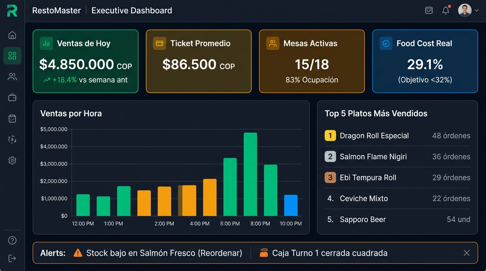
*(Figura 6.15: Tablero de control ejecutivo con ventas por hora, food cost real, ticket promedio y ranking de platos).*

* **Objetivo de Negocio:** Proporcionar al propietario y al equipo directivo la información financiera y operativa exacta para maximizar la rentabilidad del restaurante.
* **Dolor que Erradica:** Decisiones basadas en corazonadas, desconocimiento del margen real del negocio y hojas de Excel confusas que quitan tiempo a la gerencia.
* **Características Tecnológicas:**
  * **Dashboard en tiempo real:** Ventas acumuladas de la jornada, ticket promedio por mesa, número de comensales atendidos y porcentaje de ocupación del salón.
  * Gráfico de ventas por franja horaria para dimensionar picos de servicio y planificar turnos de personal.
  * Ranking de platos: Top 5 más vendidos vs platos de baja rotación (*ingeniería de menú*).
  * Reportes descargables en formato **PDF ejecutivo** y tablas **Excel / CSV** con un solo clic.
  * Comparativas periódicas: Ventas de este mes vs mes anterior, rendimiento por mesero y análisis de ventas por área de producción.
* **Flujo de Trabajo Paso a Paso:**
  1. El propietario abre RestoMaster en su teléfono móvil desde cualquier lugar del mundo.
  2. Visualiza el total vendido en el día, los cobros por tarjeta vs efectivo y las mesas ocupadas en ese instante.
  3. Con un toque, genera el informe mensual en PDF para remitir directamente al contador del restaurante.
* **KPIs Impactados:** Tiempo de elaboración de reportes (-99%), visibilidad gerencial continua (24/7).

---

### 6.16 Contabilidad Automatizada y Estado de Resultados

* **Objetivo de Negocio:** Mantener las finanzas del restaurante al día de forma automática sin incurrir en dobles digitaciones entre ventas y contabilidad.
* **Dolor que Erradica:** Descuadres contables a fin de mes, gastos de operación extraviados y balances financieros que llegan semanas después del cierre contable.
* **Características Tecnológicas:**
  * Asientos contables automáticos por cada tique cobrado, desglosando base imponible, impuestos (IVA / Impoconsumo) y propinas.
  * Registro de egresos y facturas de compras clasificados por cuentas contables de costos y gastos.
  * **Estado de Resultados en Vivo:** Ingresos operacionales menos costos de materia prima y gastos corrientes, calculando la utilidad bruta y neta del período.
  * Principio de inmutabilidad: Los registros financieros no se borran; cualquier ajuste genera un contra-asiento de auditoría dejando trazabilidad legal limpia.
* **Flujo de Trabajo Paso a Paso:**
  1. Cada cobro exitoso en el POS genera el ingreso contable sin intervención manual.
  2. Los pagos a proveedores y gastos de caja chica se imputan a su cuenta respectiva.
  3. El contador o gerente consulta el estado financiero del mes para evaluar la rentabilidad real del negocio.
* **KPIs Impactados:** Tiempo de preparación contable (-80%), precisión en declaraciones tributarias (100%).

---

## 7. Manual de Operaciones por Rol

RestoMaster adapta su interfaz automáticamente según el rol del usuario que inicia sesión:

```
┌────────────────────────────────────────────────────────────────────────┐
│                      MAPA DE PERFILES Y NAVEGACIÓN                     │
├─────────────────┬──────────────────────────────────────────────────────┤
│ ROL             │ ENTORNO INICIAL Y ACCESO EXCLUSIVO                   │
├─────────────────┼──────────────────────────────────────────────────────┤
│ 👨‍💼 Administrador │ Dashboard Maestro, Configuración, Usuarios y Permisos │
│ 👔 Gerente       │ Dashboard, Reportes, Inventario, Compras, Caja, CxP  │
│ 💳 Cajero        │ Terminal POS, Control de Caja, Clientes y Arqueo     │
│ 🤵 Mesero        │ Mapa de Mesas y Terminal Táctil de Salón             │
│ 👨‍🍳 Cocina/Barra  │ Pantalla de Comandas KDS por Partida                 │
│ 🛵 Delivery      │ Despacho de Domicilios y Asignación de Rutas         │
└─────────────────┴──────────────────────────────────────────────────────┘
```

### 7.1 Manual Rápido para el Mesero:
1. Inicie sesión en la tablet táctil de salón.
2. Observe el mapa de mesas: toque la mesa que va a atender (las mesas libres están en verde).
3. Seleccione los productos solicitados tocando las tarjetas con fotografía; si el cliente pide especificaciones, toque el ítem e ingrese la nota.
4. Presione **"Enviar a Cocina"**; la comanda viaja digitalmente a las estaciones de preparación.
5. Cuando la cocina termine, la mesa emitirá una campana visual de alerta en su tablet.
6. Sirva los platos al cliente. Al solicitar la cuenta, avise a caja o proceda al cobro si cuenta con datáfono móvil.

### 7.2 Manual Rápido para el Cajero:
1. Abra el turno ingresando el dinero de base en efectivo de su gaveta.
2. En el POS, atienda las mesas listas para cobro o las compras de mostrador.
3. Consulte al cliente si acumula puntos con su número de teléfono.
4. Seleccione el método de pago (Efectivo, Tarjeta, Mixto o Transferencia).
5. Confirme el pago e imprima el ticket térmico; el sistema libera la mesa inmediatamente.
6. Al finalizar su turno, cuente el dinero físico de la gaveta, digite el monto en el arqueo y emita su Reporte Z.

### 7.3 Manual Rápido para el Personal de Cocina:
1. Mantenga la pantalla KDS encendida en su partida de trabajo.
2. Al sonar la comanda nueva, revise los platos ordenados por orden de llegada (FIFO).
3. Toque **"Tomar"** para iniciar la cocción del platillo.
4. Al culminar la preparación, toque **"Marcar Listo"** para notificar al salón.
5. Al retirar la bandeja el mesero, toque **"Entregado"** para limpiar la pantalla.

---

## 8. Arquitectura Tecnológica y Compatibilidad de Hardware

RestoMaster está construido sobre estándares de ingeniería de software corporativo que garantizan alta disponibilidad, velocidad sub-segundo y compatibilidad multiplataforma:

* **Arquitectura de Software:**
  * **Backend Robusto:** Laravel 13 con PHP 8.3 de alto rendimiento.
  * **Base de Datos Corporativa:** PostgreSQL 18 con integridad transaccional, restricciones CHECK para montos monetarios positivos y claves foráneas 100% indexadas.
  * **Frontend Dinámico:** Blade + Livewire Volt con Alpine.js (cero recargas de página, experiencia fluida idéntica a una app nativa).
  * **Diseño Visual:** Tailwind CSS optimizado para pantallas táctiles y dark-mode gastronómico.

* **Compatibilidad de Dispositivos y Hardware:**
  * **Tablets para Salón y Meseros:** Cualquier tablet Android (pantalla 10" recomendada), iPad de Apple o comandera móvil de 6" a 8".
  * **Terminal de Caja:** Computador todo-en-uno (All-in-One) táctil, computador de escritorio tradicional (PC/Mac) o tablet montada en pedestal.
  * **Monitores de Cocina:** Tablets industriales, pantallas táctiles montadas en pared o monitores convencionales conectados a mini-PC (HDMI).
  * **Impresoras Térmicas:** Impresoras estándar de recibos de **80 mm** compatibles con comandos **ESC/POS** conectadas vía USB, Cable de Red Ethernet o Wi-Fi.
  * **Gavetas de Dinero:** Gavetas monederas estándar con apertura electrónica automática conectadas al puerto RJ11 de la impresora de recibos.

---

## 9. Seguridad de Datos, Auditoría y Cumplimiento Normativo

La seguridad de su restaurante está garantizada mediante múltiples capas de protección:

1. **Autorización Validada en Servidor (Server-Side RBAC):** La seguridad de RestoMaster no se limita a esconder botones en la pantalla; cada intento de acción sensible es verificado estrictamente en el backend antes de ser procesado.
2. **Pistas de Auditoría Inmutables:** Los registros de ventas, anulaciones, descuentos y arqueos de caja nunca se eliminan físicamente de la base de datos; cualquier anulación genera una marca histórica con fecha, hora, usuario y justificación para inspección gerencial.
3. **Restricciones de Integridad Financiera:** La base de datos rechaza por diseño cualquier monto negativo en pedidos, movimientos de caja o compras, impidiendo inconsistencias contables o errores de sistema.
4. **Cumplimiento de Habeas Data:** La captura de información de clientes para el club de puntos incluye el registro explícito del consentimiento informado conforme a las regulaciones vigentes de protección de datos personales.
5. **Copias de Seguridad (Backups):** Respaldos diarios y automáticos programables de la base de datos para garantizar la continuidad operativa ante cualquier fallo físico de los equipos del local.

---

## 10. Plan de Implementación Progresiva en 6 Fases

Nuestra metodología de despliegue por fases asegura que el restaurante continúe atendiendo comensales con normalidad durante todo el proceso de transición digital:

```
[Fase 0: Cimientos] ──► [Fase 1: Núcleo Operativo] ──► [Fase 2: Caja & Finanzas]
         │                          │                          │
[Fase 3: Recetas & Costos] ◄── [Fase 4: Clientes & Delivery] ◄── [Fase 5: Reportes & Cierre]
```

| Fase | Alcance Operativo | Duración Típica | Resultado para el Restaurante |
|---|---|:---:|---|
| **Fase 0: Cimientos y Setup** | Instalación del servidor, creación de usuarios, roles de acceso y datos fiscales de la sucursal. | Días 1 a 2 | Sistema instalado y parametrizado con la identidad del restaurante. |
| **Fase 1: Núcleo Operativo** | Carga del menú con fotos, configuración del plano de mesas, KDS de cocina e impresoras térmicas. | Días 3 a 5 | El restaurante comienza a operar 100% digital en salón y cocina. |
| **Fase 2: Caja y Finanzas** | Aperturas de turno, cobros en POS, arqueos ciegos de caja y emisión de Reportes Z. | Días 6 a 8 | Control diario absoluto del dinero en efectivo y pagos con tarjeta. |
| **Fase 3: Inventario y Recetas** | Registro de insumos, parametrização de escandallos, compras a proveedores y deducción de stock. | Días 9 a 14 | Deducción automática de materia prima y control de Food Cost real. |
| **Fase 4: Clientes y Delivery** | Activación del programa de puntos, menú digital QR en mesas y despacho de domicilios. | Días 15 a 18 | Incremento en ventas recurrentes y pedidos directos sin intermediarios. |
| **Fase 5: Reservas y Reportes** | Agenda de reservas con webhook WhatsApp y dashboard gerencial de analítica en vivo. | Días 19 a 21 | Visibilidad gerencial 24/7 y control total de ocupación. |

---

## 11. Opciones de Inversión y Paquetes Comerciales

Ofrecemos opciones comerciales flexibles que se ajustan al tamaño y volumen operativo de su establecimiento:

### 11.1 Paquetes de Adquisición

| Componente de Solución | Paquete Núcleo Operativo (POS + Salón + Caja) | Paquete Restaurante Pro (Suite Completa 16 Módulos) |
|---|:---:|:---:|
| **POS Táctil con Tarjetas Fotográficas** | ✅ Incluido | ✅ Incluido |
| **Mapa Interactivo de Mesas y Zonas** | ✅ Incluido | ✅ Incluido |
| **Cocina Digital KDS por Áreas** | ✅ Incluido | ✅ Incluido |
| **Control de Caja y Arqueo Ciego Z** | ✅ Incluido | ✅ Incluido |
| **Enrutamiento de Impresoras Térmicas** | ✅ Incluido | ✅ Incluido |
| **Menú Digital por QR en Mesas** | ✅ Incluido | ✅ Incluido |
| **Inventario y Escandallos Automáticos** | ❌ Opcional | ✅ **Incluido** |
| **Proveedores, Compras y CxP** | ❌ Opcional | ✅ **Incluido** |
| **Club de Fidelización de Clientes (Puntos)** | ❌ Opcional | ✅ **Incluido** |
| **Despacho de Delivery con Repartidores** | ❌ Opcional | ✅ **Incluido** |
| **Agenda de Reservas & Webhook WhatsApp** | ❌ Opcional | ✅ **Incluido** |
| **Dashboard Gerencial & Analítica KPI** | ⚠️ Básico | ✅ **Avanzado en Vivo** |
| **Contabilidad y Estado de Resultados** | ⚠️ Básico | ✅ **Automatizado** |
| **INVERSIÓN ESTIMADA DE IMPLEMENTACIÓN** | **[Consultar Cotización]** | **[Consultar Cotización]** |

---

### 11.2 ¿Qué Incluye la Inversión Inicial?

1. **Licencia de Uso del Software:** Licencia de explotación completa de la plataforma sin límites de mesas ni de pedidos procesados.
2. **Puesta en Marcha Técnica:** Instalación y configuración en red local o en servidor en la nube de alta velocidad.
3. **Carga Inicial de la Carta:** Digitalización y carga inicial de categorías, platos, precios y fotografías del restaurante.
4. **Capacitación Especializada del Personal:**
   * Taller práctico para meseros y anfitriones (toma ágil de comandas en tablet).
   * Taller operativo para equipo de cocina (uso del monitor KDS y despacho por partidas).
   * Taller para cajeros (cobros, cambio, egresos y arqueo ciego).
   * Taller gerencial (interpretación de reportes, costeo de recetas y control de inventarios).
5. **Acompañamiento en Vivo:** Presencia de nuestro equipo técnico en los primeros servicios reales del restaurante para garantizar una transición sin fricción.

---

## 12. Soporte Técnico, Garantía y Acompañamiento

* **Soporte Operativo Prioritario:** Mesa de ayuda telefónica y por WhatsApp disponible durante el horario de operación comercial del restaurante para resolución de incidentes en tiempo real.
* **Garantía Técnica de Software:** Garantía de funcionamiento y corrección inmediata ante cualquier anomalía de software sin costo adicional.
* **Actualizaciones Continuas:** Mejoras periódicas de rendimiento, optimizaciones de interfaz táctil y nuevas funcionalidades incluidas dentro del plan de servicio.
* **Copias de Respaldo y Protección:** Protocolo de salvaguarda de datos con respaldos periódicos programados y verificables.

---

## 13. Próximos Pasos y Formulario de Aprobación

Para iniciar la transformación digital de su restaurante con RestoMaster, el proceso continúa con los siguientes pasos:

1. **Alineación de Alcance:** Definición conjunta del paquete seleccionado (Núcleo vs Suite Pro) y el inventario de dispositivos a conectar.
2. **Emisión de la Cotización Formal:** Firma del acuerdo de servicios con el cronograma detallado de trabajo.
3. **Configuración Inicial:** Carga del catálogo gastronómico, plano del salón y usuarios del equipo.
4. **Capacitación y Despliegue:** Sesiones prácticas con el personal del restaurante.
5. **Día de Lanzamiento:** Arranque del primer servicio 100% digital con acompañamiento presencial de nuestros especialistas.

---

### Hoja de Aceptación de la Propuesta Comercial

| Firmas y Aceptación de la Propuesta |
|---|
| **Por el Restaurante Cliente:** <br><br><br> __________________________________________ <br> **Nombre:** [Nombre del Representante Legal / Propietario] <br> **Cargo:** [Gerente General / Administrador] <br> **Documento de Identidad / NIT:** ____________________ <br> **Fecha:** ______ / ______ / 2026 |
| **Por el Equipo RestoMaster:** <br><br><br> __________________________________________ <br> **Nombre:** [Nombre del Consultor Comercial] <br> **Cargo:** [Director de Soluciones Gastronómicas] <br> **Empresa:** [Razón Social de la Empresa Desarrolladora] <br> **Fecha:** ______ / ______ / 2026 |

---

*RestoMaster — Transformando la hospitalidad gastronómica con tecnología táctil, control financiero y eficiencia de clase mundial.*