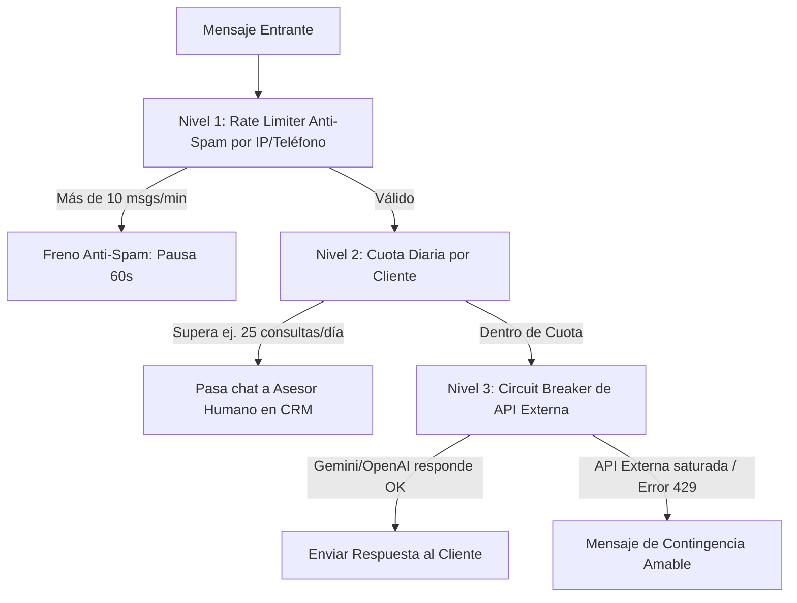

# Plan Arquitectónico Integral: Chatbot Omnicanal (Web + WhatsApp), Gestor de Chats en Vivo en CRM & Motor Resiliente de IA

> **Fecha:** 26 de Septiembre de 2026  
> **Estado:** Propuesta de Diseño, Respuestas Técnicas & Plan de Implementación  
> **Objetivo:** Dotar a RestoMaster de un sistema de comunicación omnicanal con un **Chatbot en la Página de Bienvenida**, **Integración Bidireccional con WhatsApp**, un **Gestor Gráfico de Chats en Vivo en el CRM** con control total en tiempo real (IA vs Humano), **Configuración del Tono/Personalidad del Prompt** y una **Arquitectura Resiliente** para soportar alta concurrencia, gestión de memoria eficiente, rate limiting y prevención de colapsos.

---

## 1. Respuestas Técnicas a tus Inquietudes Críticas

### 🧠 A. ¿Cómo se maneja la memoria de la IA en la Base de Datos?
* **El peligro:** Si un cliente habla durante 20 minutos y le enviamos todo el historial al LLM (Gemini u OpenAI), el consumo de tokens se dispara, la respuesta tarda 8 o 10 segundos en llegar y se corre el riesgo de superar el límite de contexto.
* **Nuestra solución (Ventana Deslizante + Resumen Semántico):**
  1. **Almacenamiento permanente:** Cada mensaje se guarda en la tabla `crm_mensajes` vinculado al chat (`crm_conversaciones`). Nada se pierde en auditoría.
  2. **Ventana Deslizante (Sliding Window):** Al consultar a la IA, el sistema **solo envía los últimos 6 a 8 mensajes** (3-4 turnos de diálogo). Con esto recuerda inmediatamente lo que se acaba de hablar (*"¿y a qué hora dijiste que abrían?"*).
  3. **Resumen de Memoria Semántica (`resumen_contexto`):** Si una conversación se alarga más de 10 mensajes, un proceso en segundo plano condensa los datos clave en una frase guardada en la conversación (ej: *"Cliente Carlos, 4 personas, celíaco, consultando mesa para viernes 8pm"*).
  4. **Inyección en el Prompt:** El LLM recibe:
     $$\text{Prompt del Sistema (Reglas y Tono)} + \text{Resumen de Contexto} + \text{Últimos 6 mensajes}$$
  *Resultado:* Máxima coherencia de memoria con el menor consumo de tokens y respuesta instantánea.

---

### ⚡ B. ¿Cómo gestiona las peticiones y evita que el sistema colapse?
* **El peligro:** Si 50 comensales escriben a la vez por WhatsApp o la Web, y cada llamada a la IA toma 2 o 3 segundos, ejecutarlo de forma síncrona en el servidor web (PHP-FPM/Nginx) bloquearía los puertos del servidor web, arrojando errores `502 Bad Gateway` y congelando el sistema. Además, Meta WhatsApp exige responder con `HTTP 200` en menos de 15 segundos o de lo contrario reintenta el mensaje en bucle.
* **Nuestra solución (Arquitectura Asíncrona con Colas de Laravel):**
  1. **Recepción Ultrarrápida (< 50 milisegundos):** El webhook de WhatsApp o la llamada web recibe el mensaje, lo almacena en la base de datos y **responde `HTTP 200 OK` de inmediato**.
  2. **Cola de Tareas en Segundo Plano (`ProcesarMensajeConversacionJob`):** El procesamiento de la IA se envía a la cola de Laravel (`database` o `redis`).
  3. **Workers Desacoplados:** Los workers procesan los mensajes de manera fluida y ordenada. Si hay un pico masivo, los mensajes esperan en la cola unos segundos sin congelar la web.
  4. **Aislamiento Total del POS y Cocina:** El Terminal POS, el KDS de cocina y la facturación corren en procesos independientes. **Jamás se verán afectados** por la actividad del chat.

---

### 🛡️ C. ¿Cómo se manejan los Rate Limits y la Prevención de Abusos?
Diseñamos un escudo concéntrico en 3 niveles:



1. **Nivel 1 — Anti-Spam por Minuto (Laravel RateLimiter):** Máximo 10 mensajes por minuto por usuario/número. Si un bot o usuario envía ráfagas, el sistema lo frena antes de tocar la API de IA.
2. **Nivel 2 — Cuota Diaria por Cliente (`ia_cuota_diaria_cliente`):** Ya implementada en `CrmConfiguracion` (ej: 25 consultas/día por cliente). Si se excede, la IA no consume más tokens y responde: *"Has alcanzado el límite de consultas automáticas de hoy. Un anfitrión de nuestro equipo continuará asistiéndote"*, transfiriendo el chat al personal.
3. **Nivel 3 — Circuit Breaker:** Si la API de Gemini o OpenAI devuelve error `429 Too Many Requests`, el sistema reintenta con retroceso exponencial (*exponential backoff*). Si la falla persiste, activa automáticamente una respuesta de contingencia pre-almacenada sin mostrar errores técnicos al usuario.
4. **Kill-Switch Manual de Emergencia:** Con 1 solo clic en el CRM, el administrador puede apagar la IA por completo si nota cualquier comportamiento inesperado.

---

## 2. Configuración de Conducta y Personalidad de la IA

Permitiremos al administrador definir cómo "habla" la IA desde la pestaña de IA del CRM:

1. **Selector de Tono de Conducta:**
   - 🍷 **Cálido & Gourmet (Recomendado):** Hospitalario, educado, sugiere platos y maridajes con elegancia.
   - ⚡ **Ágil & Conciso:** Respuestas breves y directas (horarios, ubicación, link de reserva).
   - 👔 **Formal & Distinguido:** Tratamiento de usted, sobriedad y etiqueta protocolaria.
   - 🎨 **Personalizado:** Control total para el restaurante.
2. **Editor de Directivas de Personalidad y Estilo (Campo de Texto Libre en CRM):**
   - El administrador podrá escribir instrucciones directas como:
   > *"Sé sumamente amable, sonriente y acogedor. Si el cliente menciona que celebra un cumpleaños o aniversario, felicítalo con calidez y sugiérele nuestra mesa VIP en terraza y el Tomahawk con trufa. Usa emojis gastronómicos con moderación (✨🥩🍷). Nunca seas cortante ni uses tecnicismos."*

---

## 3. La Interfaz Gráfica: Gestor de Chats en Vivo en el CRM (`/crm` -> Pestaña "Chats & Mensajería")

Creamos una pestaña dedicada en el CRM con una interfaz en tiempo real de 3 paneles diseñada para pantallas táctiles y desktop:

```
┌───────────────────────────┬─────────────────────────────────────────────────────────────┬───────────────────────────┐
│ BANDEJA DE CONVERSACIONES │ VENTANA DE CHAT ACTIVO                                      │ FICHA DEL COMENSAL        │
├───────────────────────────┼─────────────────────────────────────────────────────────────┼───────────────────────────┤
│ [Buscar comensal...]     │ 🟢 Carlos Restrepo (+57 300 123 4567)  [WhatsApp]            │ Carlos Restrepo           │
│ Filtros:                  │ ─────────────────────────────────────────────────────────── │ Cliente VIP               │
│ [Todos] [🚨Requiere Staff]│ [INTERRUPTOR MODO CHAT]:                                    │ Visitas: 14 veces         │
│ [🤖En Modo IA] [WhatsApp] │ (🔘 Modo IA Automático)  ⇄  (🔘 Modo Humano / Staff)        │ Último plato: Tomahawk    │
├───────────────────────────┤ ─────────────────────────────────────────────────────────── ├───────────────────────────┤
│ 🚨 Andrea Vélez (Web)     │ [Cliente - 12:02 PM]                                        │ Reservas Activas:         │
│ "¿Puedo hablar con alguien│ Hola, ¿tienen mesa para 4 personas hoy a las 8pm?           │ Mesa 4 (Terraza)          │
│ ───────────────────────── │                                                             │ Viernes 8:00 PM (4 pax)   │
│ 🤖 Carlos Restrepo (WA)   │ [🤖 IA Concierge - 12:02 PM]                                │                           │
│ "¡Claro! Nuestra carta..."│ ¡Hola Carlos! Qué alegría saludarte. Sí, tenemos terraza... │ [Acciones Rápidas]:       │
│ ───────────────────────── │                                                             │ [📅 Crear Reserva]        │
│ 👤 Juan Gómez (WA)        │ [Staff: Mariana (Hostess) - 12:04 PM]                       │ [⭐ Asignar Puntos VIP]   │
│ "Gracias por la mesa"     │ Carlos, te confirmo que la mesa 4 ya está separada para ti. │ [🚫 Bloquear Contacto]    │
│                           ├─────────────────────────────────────────────────────────────┤                           │
│                           │ [Escribe una respuesta para enviar a WhatsApp...]  [ENVIAR] │                           │
│                           │ Plantillas: [Confirmar Mesa] [Ubicación] [Carta Digital]    │                           │
└───────────────────────────┴─────────────────────────────────────────────────────────────┴───────────────────────────┘
```

### Características de la Interfaz:
1. **Control Total por Conversación (IA vs Humano):**
   - Cada chat tiene su propio interruptor independiente.
   - Si está en `🤖 Modo IA Automático`, la IA responde al comensal.
   - Si el operador hace clic en `[👤 Tomar Control / Responder Yo Mismo]`, la IA entra en pausa para ese cliente específico.
   - Si el operador escribe directamente y envía un mensaje, el sistema pasa la conversación automáticamente a `Modo Humano` para no interrumpir la atención.
   - Cuando el operador termine, presiona `[🤖 Devolver a la IA]` y el bot retoma la conversación conociendo todo lo que el staff conversó.
2. **Diferenciación Visual Interna (Indistinguible para el Cliente):**
   - En el CRM, el staff ve claramente quién dijo qué:
     - Burbuja de la **IA** con distintivo `[🤖 IA Concierge]`.
     - Burbuja del **Staff** con distintivo `[👤 Mariana (Tú)]`.
   - Pero para el cliente que lee en WhatsApp o en la Web, la respuesta sale limpia y homogénea desde la cuenta oficial de RestoMaster.
3. **Alertas en Tiempo Real:**
   - Si un cliente escribe palabras como *"persona", "humano", "asesor", "queja"*, o si la IA detecta que el cliente necesita ayuda humana, la conversación se ilumina en ámbar/rojo con badge pulsante `🚨 Requiere Asesor Humano` y emite un sonido sutil de notificación.

---

## 4. Plan de Ejecución por Fases

### Fase 1: Base de Datos & Modelos de Conversación (Migraciones)
- Crear tabla `crm_conversaciones`:
  - `canal` (`web`, `whatsapp`), `identificador_remoto`, `cliente_id` (nullable), `user_id_asignado` (staff), `modo_atencion` (`ia`, `humano`), `estado` (`activa`, `esperando_humano`, `cerrada`), `resumen_contexto`, `ultimo_mensaje_at`.
- Crear tabla `crm_mensajes`:
  - `crm_conversacion_id`, `emisor` (`cliente`, `bot`, `staff`), `user_id` (nullable), `contenido`, `metadata` (tokens, canal), `created_at`.
- Agregar campos a `crm_ia_plantillas_privilegios` y `crm_configuraciones`:
  - `tono_conducta` (`amable_calido`, `formal_elegante`, `entusiasta_gourmet`, `conciso_directo`, `personalizado`).
  - `prompt_personalidad` (directivas libres de estilo y cortesía).

### Fase 2: Configuración de Personalidad en la UI de CRM
- Añadir en la pestaña IA de [`resources/views/livewire/crm/index.blade.php`](file:///d:/Proyectos/restomaster/resources/views/livewire/crm/index.blade.php):
  - Selector de Presets de Tono.
  - Textarea de Directivas de Personalidad y Estilo.
- Inyección dinámica de estos parámetros en [`CrmAiAgentService`](file:///d:/Proyectos/restomaster/app/Services/Ai/CrmAiAgentService.php).

### Fase 3: Motor Asíncrono, Memoria Deslizante & Rate Limiting
- Crear `ProcesarMensajeConversacionJob` para ejecución en segundo plano (colas).
- Implementar la ventana deslizante (últimos 6-8 mensajes) y resumen semántico.
- Integrar `RateLimiter` (10 msgs/min por cliente) y Circuit Breaker con retry backoff.

### Fase 4: Widget de Chatbot en la Página de Bienvenida
- Componente flotante Livewire Volt en [`resources/views/layouts/publico.blade.php`](file:///d:/Proyectos/restomaster/resources/views/layouts/publico.blade.php).
- Botones rápidos: Carta, Reservar, Asesor Humano, persistencia en sesión.

### Fase 5: Interfaz Gráfica del Gestor de Chats en Vivo en `/crm`
- Nueva pestaña en la barra de navegación del CRM: **"Chats & Mensajería"** con contador de chats pendientes.
- Vista de 3 paneles (Lista de chats con filtros, Ventana activa en tiempo real con interruptor IA/Humano, y Ficha de contexto del cliente).
- Botón de **"Tomar Control"** / **"Ceder a la IA"** y caja de envío omnicanal (despacho a Web o WhatsApp).

### Fase 6: Pruebas Automatizadas de Integración y Regresión
- Feature tests para recepción de webhook, handoff humano/IA, límites de cuota y renderizado reactivo del inbox.
